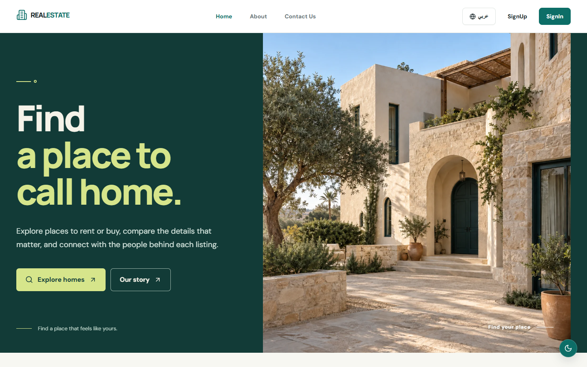
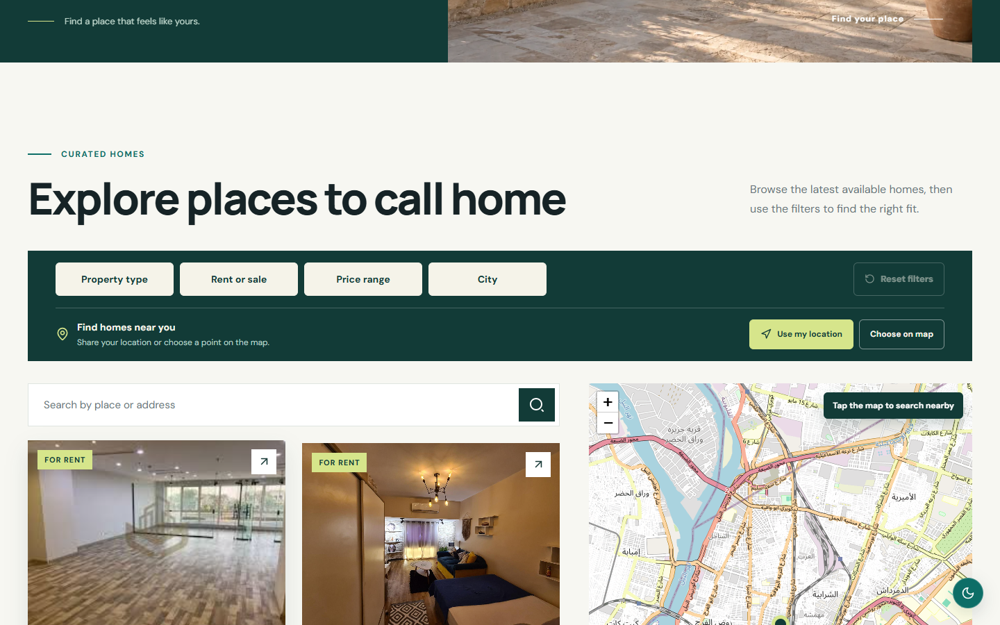
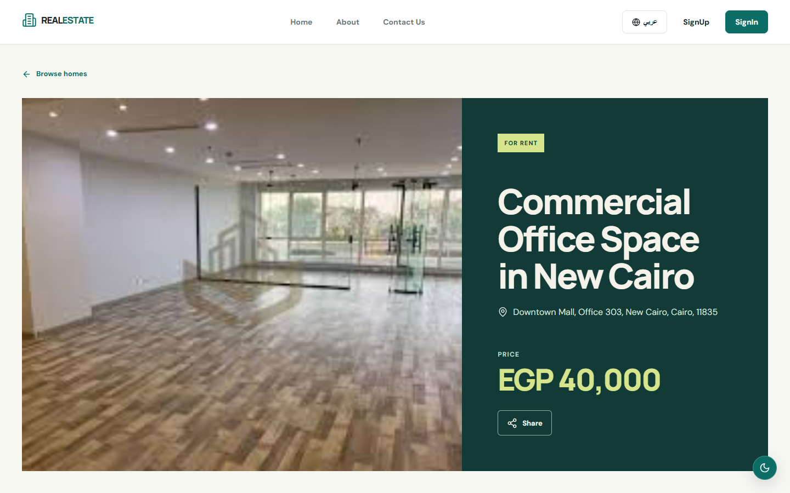
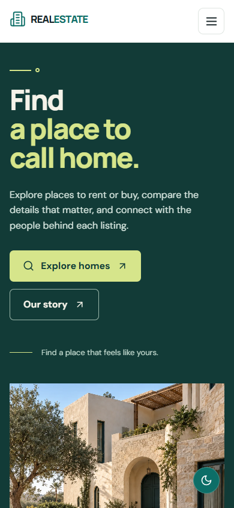

# Real Estate Management

A bilingual property marketplace for exploring homes in Egypt and managing listings. Visitors can browse rentals and properties for sale, search by location, compare listing details, and contact owners. Signed-in owners can publish and manage their properties.

**[Live site](https://real-estate-management-mu.vercel.app/)** · **[Project repository](https://github.com/abdallahedreeso/real-estate-management)**

## Screenshots

Captured from the current UI running locally with public listing data.

### Home page



### Explore listings



### Property details



<details>
<summary>Mobile home page</summary>



</details>

## Features

- **Discover properties:** Browse rentals and sales with property type, price, city, address, and nearby location filters. Explore results in a list and on a map.
- **Inspect listings:** Open a property page for photos, location, price, details, and sharing options.
- **Manage properties:** Authenticated owners can create, edit, and view their listings.
- **Connect with owners:** Signed-in users can save favorites and start property conversations, with message notifications.
- **Use the app your way:** English and Arabic interfaces, right-to-left layout, dark mode, responsive screens, and installable PWA support.
- **Prepare protected sales:** Sale listings support authority evidence review, versioned buyer and seller terms, private deal documents, case timelines, disputes, and a staff review queue. The closing flow includes a clearly labeled **simulation** for training. Real payments, funding instructions, and payouts are disabled. See [Sale operations](SALE_OPERATIONS.md).

## Tech stack

| Area | Technology |
| --- | --- |
| Frontend | React 18, Vite, React Router |
| UI | Ant Design, Tailwind CSS, Lucide icons |
| Data and storage | Supabase, Zustand |
| Authentication | Clerk |
| Maps | Leaflet and React Leaflet |
| Localization | i18next and react-i18next |
| Testing | Vitest and Playwright |
| Hosting | Vercel |

## Run locally

You need Node.js and npm, a Clerk application, and a Supabase project with the application schema and migrations applied. The frontend uses Clerk for authentication and Supabase for data and storage.

1. Install dependencies:

   ```bash
   npm ci
   ```

2. Copy `.env.example` to `.env` and fill in the client configuration:

   ```dotenv
   VITE_CLERK_PUBLISHABLE_KEY=...
   VITE_SUPABASE_URL=...
   VITE_SUPABASE_ANON_KEY=...
   ```

   Use the Clerk publishable key and the Supabase anonymous key, never server-side secret keys. The app shows a configuration screen when a required value is missing. The optional `VITE_PROTECTED_SALES_ENABLED=false` setting hides the protected sales UI for an emergency rollback.

3. Start the development server:

   ```bash
   npm run dev
   ```

   Open the local URL printed by Vite, normally `http://localhost:5173`.

The SQL changes in [`supabase/migrations`](supabase/migrations) cover property categories, inquiries, secure images, protected sales, and closing simulation. Apply them to a compatible Supabase schema in timestamp order. For deployment and reviewer access details, use the [sale operations runbook](SALE_OPERATIONS.md).

## Project commands

| Command | Purpose |
| --- | --- |
| `npm run dev` | Start the Vite development server |
| `npm run build` | Create a production build in `dist/` |
| `npm run preview` | Preview the production build locally |
| `npm run lint` | Run ESLint |
| `npm test` | Run Vitest unit and component tests |
| `npm run test:e2e` | Run Playwright browser tests |
| `npm run test:sales-db` | Verify protected sales database behavior in an in-memory PostgreSQL runtime |

## Deployment and sharing

The project includes [Vercel routing](vercel.json) and a listing-specific preview endpoint for shared `/property/:id` links. Set the same required `VITE_` variables in the deployment environment. `SITE_URL` is optional when deploying outside the configured Vercel production domain; it supplies the public origin for social metadata. The homepage preview image can be regenerated with `node scripts/generate-link-preview.mjs`.

## Team

- Abdallah Edrees — team lead
- Shahd AlSayed
- Emad Mostafa
- Yousef Halawa
- Rana Amr

Built by **Component Crafterz**. Additional project materials: [presentation](https://docs.google.com/presentation/d/18HFNo-JX4dboGwW9HEB05ByOMCMeOB_D/edit) and [proposal](https://docs.google.com/document/d/1vuSesYbvglFRYP84SxC5njGoCeFObM9x/edit).
